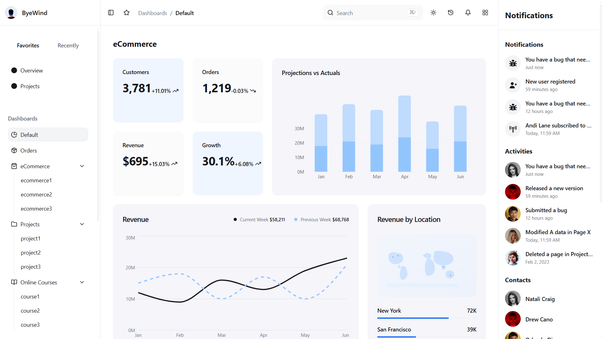
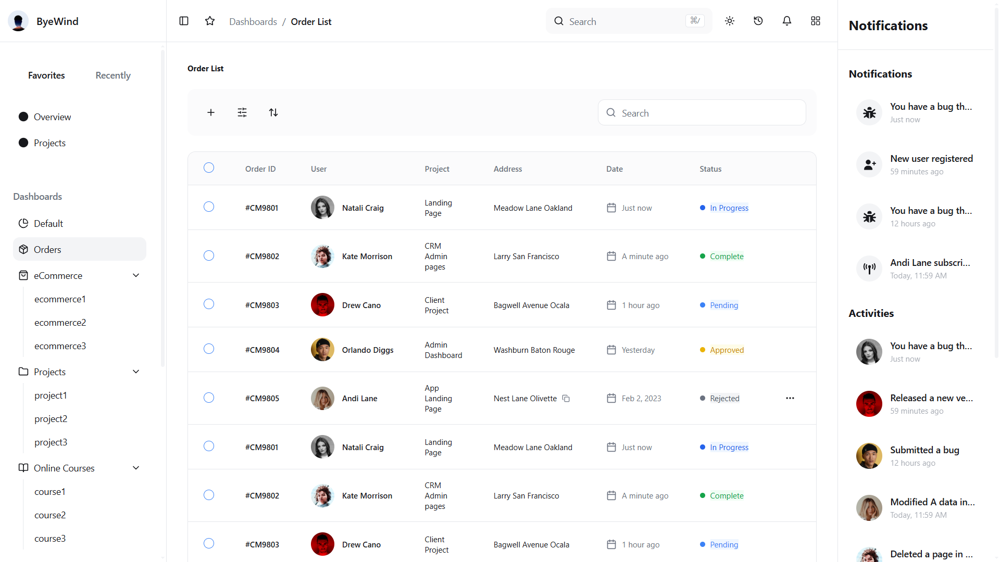

# ByeWind Dashboard & Analytics

## Project info

Modern dashboard for eCommerce analytics, order management, and business insights.

project link  : [Live Demo](https://dashboard-kunal-bamoriya.vercel.app/)

** for using my project **

```sh
# Step 1: Clone the repository using the project's Git URL.
git clone <YOUR_GIT_URL>

# Step 2: Navigate to the project directory.
cd <YOUR_PROJECT_NAME>

# Step 3: Install the necessary dependencies.
npm i

# Step 4: Start the development server with auto-reloading and an instant preview.
npm run dev
```

## tech stack : 

This project is built with:

- Vite
- TypeScript
- React
- shadcn-ui
- Tailwind CSS

## My Project 

## Screenshots 






